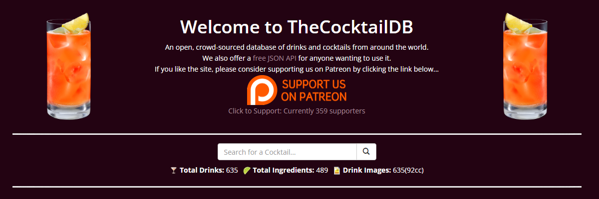

## Cocktail webapp using Flask
Made using [Flask](https://github.com/pallets/flask)

<p align="center">

</p>

```python
from flask import Flask
```

Created using [TheCocktailDB](https://www.thecocktaildb.com/) API

<p align="center">

</p>


Deployed using [Pythonanywhere](https://www.pythonanywhere.com/):

 https://brandbk125.pythonanywhere.com/


